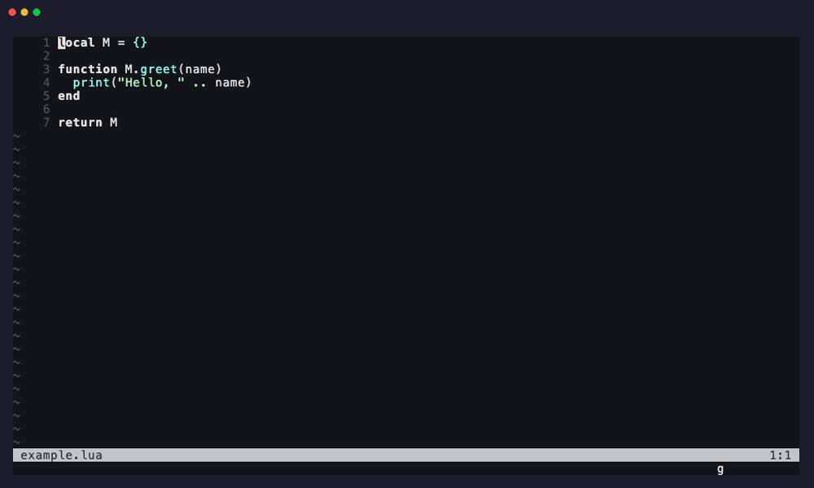

# neocrush.nvim

Neovim plugin for [neocrush](https://github.com/taigrr/neocrush) integration.



## Features

- **Edit Highlighting**: Flash highlights on AI-generated edits (like yank highlight)
- **Auto-focus**: Automatically focus and scroll to edited files
- **AI Locations Picker**: Custom Telescope picker for AI-annotated code locations with 3-pane UI
- **Terminal Management**: Toggle/focus/restart Crush terminal
- **Cursor Sync**: Send cursor position to neocrush for context awareness
- **Version Manager (CVM)**: Browse and install crush releases from GitHub or build from a local repo clone
- **Health Check**: Verify setup with `:checkhealth neocrush`

## Requirements

- Neovim >= 0.10
- [neocrush](https://github.com/taigrr/neocrush) binary in PATH
- [crush](https://github.com/charmbracelet/crush) CLI for terminal integration
- [telescope.nvim](https://github.com/nvim-telescope/telescope.nvim) for AI locations picker and CVM
- Go (for `:CrushInstallBinaries`/`:CrushUpdateBinaries` and CVM installs)
- [`gh`](https://cli.github.com/) CLI (authenticated) for `:CrushCvmReleases`
- [`glow`](https://github.com/charmbracelet/glow) (optional) for formatted release notes in CVM picker

## Installation

```lua
-- lazy.nvim
{
  'taigrr/neocrush.nvim',
  dependencies = { 'nvim-telescope/telescope.nvim' },
  event = 'VeryLazy',
  opts = {
    -- All options are optional with sensible defaults
    highlight_group = 'IncSearch',  -- Flash highlight group
    highlight_duration = 900,        -- Flash duration (ms)
    auto_focus = true,               -- Auto-focus edited files
    terminal_width = 80,             -- Terminal width in columns
    terminal_cmd = 'crush',          -- Command to run in terminal

    -- Crush Version Manager
    cvm = {
      upstream = 'charmbracelet/crush',  -- GitHub owner/repo (change for forks)
      local_repo = '~/src/crush',        -- Default path for :CrushCvmLocal
    },

    -- Optional keybindings (none set by default)
    keys = {
      toggle = '<leader>cc',
      focus = '<leader>cf',
      logs = '<leader>cl',
      cancel = '<leader>cx',
      restart = '<leader>cr',
      paste = '<leader>cp',  -- Works in normal (clipboard) and visual (selection) mode
      cvm_releases = '<leader>cv',
      cvm_local = '<leader>cV',
    },
  },
}
```

**Note**: The plugin starts the LSP on `VimEnter`, so use `event = 'VeryLazy'` to load after UI is ready.

## Commands

| Command                 | Description                                       |
| ----------------------- | ------------------------------------------------- |
| `:CrushToggle`          | Toggle the Crush terminal window                  |
| `:CrushOpen`            | Open the Crush terminal                           |
| `:CrushClose`           | Close the Crush terminal (keeps buffer)           |
| `:CrushFocus`           | Focus the Crush terminal                          |
| `:CrushWidth <n>`       | Set terminal width to n columns                   |
| `:CrushLogs`            | Show Crush logs in a new buffer                   |
| `:CrushCancel`          | Cancel current operation (sends `<Esc><Esc>`)     |
| `:CrushRestart`         | Kill and restart the Crush terminal               |
| `:CrushPaste [reg]`     | Paste register (default: `+`) or selection        |
| `:CrushFocusToggle`     | Toggle auto-focus behavior                        |
| `:CrushFocusOn/Off`     | Enable/disable auto-focus                         |
| `:CrushInstallBinaries` | Install neocrush and crush binaries (requires Go) |
| `:CrushUpdateBinaries`  | Update binaries to latest version                 |
| `:CrushCvmReleases`    | Browse and install crush releases from GitHub      |
| `:CrushCvmLocal [path]` | Browse and install crush from local repo commits   |

### Pasting Registers

`:CrushPaste` defaults to system clipboard (`+`).
Pass a register name to paste from a specific register:

```vim
:CrushPaste a   " Paste from register a
:CrushPaste "   " Paste from unnamed register
:CrushPaste *   " Paste from primary selection (X11)
```

In visual mode, `:CrushPaste` pastes the current selection.

### Crush Version Manager (CVM)

`:CrushCvmReleases` opens a Telescope picker listing all GitHub releases.
The currently installed version is highlighted in green.
Selecting a release installs it via `go install`.
Release notes are shown in the preview pane (rendered with `glow` if available).

`:CrushCvmLocal [path]` opens a Telescope picker listing commits from a local
crush repo clone. HEAD is highlighted in blue. Selecting a commit checks it out
and runs `go install .` to build.

If no path is given, `cvm.local_repo` from your config is used.

Set `cvm.upstream` to a fork's `owner/repo` to browse and install from a
different source.

## API

```lua
local crush = require('neocrush')

crush.toggle()              -- Toggle terminal
crush.open() / crush.close() / crush.focus()
crush.set_width(100)

crush.logs()                -- Show logs in new buffer
crush.cancel()              -- Cancel operation (<Esc><Esc>)
crush.restart()             -- Kill and restart terminal
crush.paste()               -- Paste clipboard
crush.paste('a')            -- Paste register "a"
crush.paste_selection()     -- Paste visual selection

crush.toggle_auto_focus()   -- Toggle auto-focus
crush.start_lsp()           -- Manually start LSP
crush.get_client()          -- Get LSP client instance

-- Crush Version Manager
local cvm = require('neocrush.cvm')
cvm.pick_releases()         -- Open GitHub releases picker
cvm.pick_local('~/src/crush') -- Open local repo commits picker
cvm.get_current_version(function(v) print(v) end)
```

## How It Works

1. **LSP Integration**: Starts `neocrush` on `VimEnter` with no filetype restrictions
2. **Edit Handler**: Overrides `workspace/applyEdit` to flash highlight edits and scroll them into view
3. **Cursor Sync**: Sends `crush/cursorMoved` notifications for context awareness
4. **Terminal**: Manages a persistent terminal buffer for the Crush CLI

## Important Notes

**Do NOT add neocrush to Mason/lspconfig.**
This plugin manages the LSP client directly.
If you have neocrush in your LSP config, remove it.

## Known Limitations

When Crush edits open files, you may see external modification warnings.
Add `vim.o.autoread = true` to auto-reload unchanged files.
